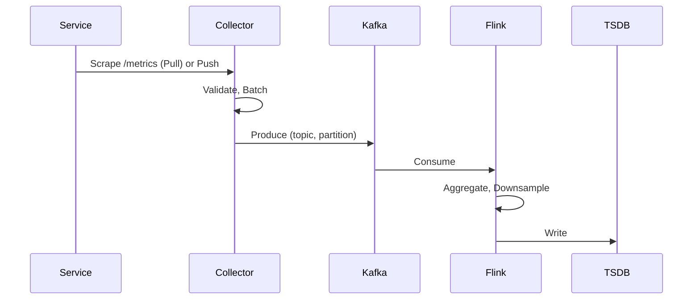
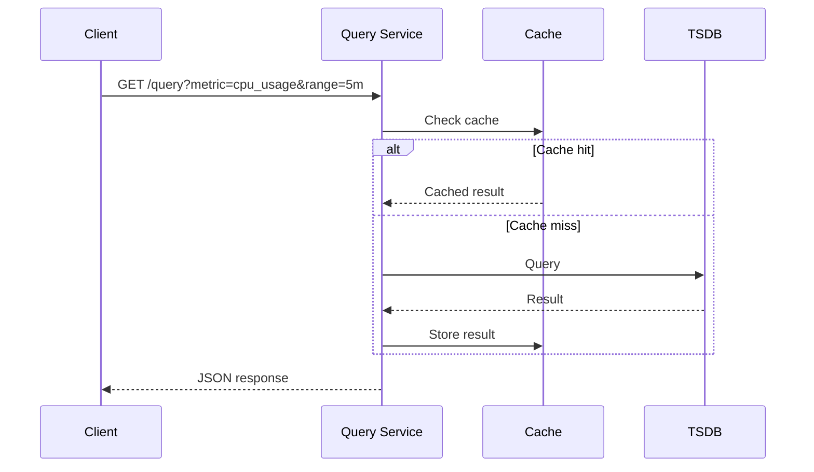
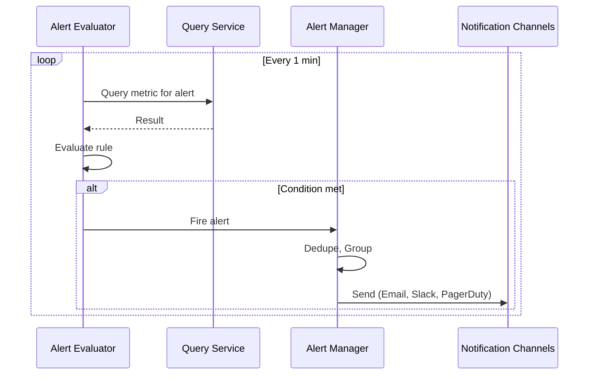

# Distributed Monitoring and Alerting System

> **System Design Interview Document** — FAANG-level technical interview preparation  
> *Design a scalable, low-latency, and reliable metrics collection, storage, and alerting platform.*

---

## Table of Contents

1. [Problem Statement](#1-problem-statement)
2. [Requirements](#2-requirements)
3. [Capacity Estimation](#3-capacity-estimation)
4. [Metric Data Model](#4-metric-data-model)
5. [High-Level Architecture](#5-high-level-architecture)
6. [Detailed Component Design](#6-detailed-component-design)
7. [Data Flow](#7-data-flow)
8. [Storage Design](#8-storage-design)
9. [API Design](#9-api-design)
10. [Key Design Decisions](#10-key-design-decisions)
11. [Scaling & Non-Functional Requirements](#11-scaling--non-functional-requirements)
12. [Security](#12-security)
13. [OpenTelemetry Pipeline](#13-opentelemetry-pipeline)
14. [Trade-offs & Alternatives](#14-trade-offs--alternatives)

---

## 1. Problem Statement

Design a **Distributed Monitoring and Alerting System** that:

- Collects metrics from thousands of services (microservices, VMs, containers)
- Stores metrics for historical analysis and real-time dashboards
- Evaluates alert rules and delivers notifications when thresholds are breached
- Scales horizontally to handle millions of data points per second
- Ensures critical alerts are never missed

**Reference Diagram:** See [Overall System Design](#51-overall-system-design) for the hand-drawn architecture diagram.

### 1.1 Interview Narrative (what I would say)

In a real interview, I’d frame this as **two critical paths**:

- **Write path (telemetry ingestion)**: services expose/emit metrics → collectors normalize and batch → Kafka buffers bursts and decouples producers/consumers → stream processing builds rollups/downsamples → TSDB stores hot + warm + cold tiers.
- **Read/decision path (query + alerting)**: dashboards and alert rules query through a stateless query layer + cache → alerting evaluates rules on a schedule, dedupes/groups, and routes notifications with retries and escalation.

Then I call out the **big risks** (this is where senior engineers spend time):

- **Cardinality explosion** from labels (can take down TSDB and queries)
- **Backpressure** and burst handling across collectors/Kafka/processing/TSDB
- **Correctness** (duplicates, late samples, clock skew, gaps)
- **Alert quality** (noise, dedupe, “for” windows, escalation)
- **Multi-tenancy + security** (RBAC, encryption, audit trail)

### 1.2 Deep-dive pivots (when the interviewer asks “tell me more”)

- **Collectors**: scrape scheduling/jitter, timeouts/concurrency, discovery/health
- **Kafka**: partition key, ordering boundaries, consumer scaling
- **TSDB**: sharding/indexing/compaction and query fan-out
- **Alerting**: HA evaluation, dedupe, silences, notification reliability

---

## 2. Requirements

### 2.1 Functional Requirements

| ID | Requirement | Priority |
|----|-------------|----------|
| FR1 | Collect metrics from application servers and infrastructure | P0 |
| FR2 | Store metrics with configurable retention (e.g., 15 days hot, 1 year cold) | P0 |
| FR3 | Support ad-hoc and range queries (e.g., `cpu_usage{host=server1}[5m]`) | P0 |
| FR4 | Evaluate alert rules against metric data and trigger notifications | P0 |
| FR5 | Deliver alerts via multiple channels (Email, Slack, PagerDuty, SMS) | P0 |
| FR6 | Support dashboards and visualization (Grafana-style) | P1 |
| FR7 | Support metric aggregation (sum, avg, rate, percentiles) | P1 |

### 2.2 Non-Functional Requirements

| ID | Requirement | Target |
|----|-------------|--------|
| NFR1 | **Scalability** | Handle 10M+ data points/sec, 100K+ unique time series |
| NFR2 | **Low Latency** | End-to-end metric visibility < 30s; alert evaluation < 1 min |
| NFR3 | **Reliability** | 99.99% alert delivery; no data loss for critical metrics |
| NFR4 | **Availability** | 99.9% uptime for query and alerting paths |
| NFR5 | **Cost Efficiency** | Downsample/archive old data; optimize storage per metric type |
| NFR6 | **Security** | Encryption in transit (TLS/mTLS); RBAC on query and alert APIs |

---

## 3. Capacity Estimation

### 3.1 Assumptions

| Parameter | Value |
|-----------|-------|
| Number of services | 10,000 |
| Metrics per service | 100 |
| Scrape interval | 15 seconds |
| Unique time series | ~1M |
| Data points per second | ~6.7M (10K × 100 / 15) |
| Metric size (avg) | ~100 bytes |
| Write throughput | ~670 MB/s |
| Query QPS | ~10,000 |

### 3.2 Storage (10 years)

| Retention | Resolution | Storage (approx) |
|-----------|------------|------------------|
| 15 days | 15s | ~100 TB |
| 90 days | 1m | ~50 TB |
| 1 year | 5m | ~100 TB |
| 10 years | 1h | ~200 TB |

**Total:** ~450 TB (raw + compressed)

### 3.3 Staff-level capacity gotchas (where systems fail)

- **Cardinality dominates**: cost grows with the number of unique time series. Roughly:
  \[
  \text{series} \approx \sum_{\text{metric}} \prod_{\text{label}} |\text{values}|
  \]
  One high-cardinality label (e.g., `user_id`, `request_id`, `path`) can turn **1M series into 100M+**.
- **Read load is spiky and fan-out**: dashboards trigger many range queries and can fan out across shards/blocks; plan for bursty query concurrency.
- **Write amplification**: raw samples + index updates + rollups + compaction typically require **2–5×** raw ingest headroom.
- **Correlated spikes**: deploys/incidents increase traffic and error rates → more metrics and more alert evaluations at the worst possible time.

---

## 4. Metric Data Model

### 4.1 Core Structure

```json
{
  "metric_name": "cpu_usage",
  "labels": {
    "host": "server1",
    "service": "checkout-api",
    "env": "prod",
    "region": "us-east-1"
  },
  "timestamp": 1698765432000,
  "value": 72.5
}
```

### 4.2 Schema Definition

| Field | Type | Description |
|-------|------|-------------|
| `metric_name` | string | Identifier (e.g., `cpu_usage`, `memory_utilization`, `request_latency_p99`) |
| `labels` | map<string, string> | Dimensions for filtering (host, service, env, instance_id) |
| `timestamp` | int64 (ms) | Unix epoch when metric was recorded |
| `value` | float64 | Numeric measurement |

### 4.3 Staff-level conventions (to avoid long-term pain)

- **Names + units**: enforce conventions like `snake_case` and explicit units (`_seconds`, `_bytes`, `_total`) so queries and alerts are unambiguous.
- **Label hygiene**: define allow/deny lists and per-metric label budgets; reject/strip high-cardinality labels at ingestion.
- **Tenant isolation**: for a shared platform, treat `tenant_id` as first-class and enforce per-tenant quotas (ingest rate, series count, query cost).
- **Exemplars (optional)**: attach trace IDs to some metric points to pivot from “latency spike” to “sample trace” quickly.

### 4.4 Metric Types

| Type | Example | Use Case |
|------|---------|----------|
| Counter | `http_requests_total` | Monotonically increasing |
| Gauge | `memory_usage_bytes` | Current value |
| Histogram | `request_duration_seconds` | Distribution (percentiles) |
| Summary | `request_duration_seconds` | Pre-aggregated quantiles |

---

## 5. High-Level Architecture

### 5.1 Overall System Design

The following diagram provides a high-level view of the distributed monitoring and alerting system — from metric sources through collection, ingestion, processing, storage, and finally to querying, alerting, and visualization.


*Figure: End-to-end architecture showing Services → Collectors (with Zookeeper discovery) → Kafka → Flink/Spark → Time Series DB → Query Service (with Cache) → Alerting & Visualization*

---

## 6. Detailed Component Design

### 6.1 Metric Sources (Application Servers)

**How metrics are collected and where they are stored:**

| Approach | Location | Mechanism |
|----------|----------|-----------|
| **Client Library** | In-process memory | SDK exposes counters/gauges (e.g., Prometheus client) |
| **Sidecar Agent** | Local memory / ephemeral disk | Agent scrapes `/metrics` or receives push |
| **Exporter** | Node exporter, cAdvisor | Exposes system metrics via HTTP |

**Storage on App Server:** Metrics are typically held in **in-memory** structures (counters, histograms) until scraped. No persistent storage on the app server unless using a push buffer (e.g., for batch jobs).

### 6.2 Metrics Collectors

**Responsibilities:**

- Discover targets via Zookeeper/etcd/Consul
- Scrape metrics on a schedule (Pull) or receive metrics (Push)
- Validate and normalize format
- Batch and forward to Kafka

**Operational details (what makes collectors robust):**

- **Scrape jitter**: randomize scrape start times to avoid synchronized spikes (thundering herds).
- **Timeouts + concurrency**: per-target timeouts (e.g., 3–5s) and global concurrency limits so collectors don’t overload the fleet.
- **Retry policy**:
  - Scrapes: minimal retries (retries can amplify load); prefer “try again next interval.”
  - Kafka produce: retries with backoff and bounded queueing.
- **Overload protection**: if Kafka is slow/unavailable, apply backpressure and drop low-priority metrics first (or spill to disk only with strict bounds).
- **Clock skew**: pull path typically uses collector timestamps; push path must handle skew and clamp extreme timestamps.

**Load Distribution:**

- **Consistent Hashing:** Map each `(source_id, metric_name)` to a dedicated collector
- Ensures same source is always scraped by the same collector (reduces thundering herd)
- On collector failure, rebalance via ring

**Scaling:** Add collectors; new sources get assigned via consistent hash.

### 6.3 Kafka — Topics & Partitions

**Topic:** A logical channel for a category of records (e.g., `metrics.cpu_usage`).

**Partition:** A topic is split into ordered, immutable logs. Each partition is stored on a broker.

**Why Partitions?**

| Benefit | Explanation |
|---------|-------------|
| **Throughput** | Multiple producers/consumers can write/read in parallel |
| **Ordering** | Order guaranteed per partition (key-based routing) |
| **Fault Tolerance** | Replicas across brokers |
| **Consumer Group** | Each partition consumed by one consumer in a group |

**Partitioning Strategy:**

- **By metric_name:** `hash(metric_name) % num_partitions` — co-locate same metric type
- **By labels:** `hash(host, service) % num_partitions` — locality for same host

**Staff-level note (ordering, keys, duplicates):**

- Ordering is only guaranteed **within a partition**. If downstream rollups are per-series, key by a stable series identifier (e.g., `hash(tenant_id, metric_name, labels)`).
- Most monitoring pipelines operate **at-least-once** (especially with Kafka + stream processing). Plan for duplicates and make ingestion tolerant:
  - treat `(series_id, timestamp)` as idempotent where possible
  - use last-write-wins semantics if duplicates occur
- Avoid “exactly-once everywhere” as a default—it’s costly and rarely worth it for metrics (alerts should be robust to minor duplication).

**Topic Layout:**

```
metrics.cpu_usage      (partition 0..N)
metrics.memory_usage   (partition 0..N)
metrics.request_latency (partition 0..N)
metrics.custom.*      (partition 0..N)
```

### 6.4 Stream Processing (Flink / Spark / Kafka Streams)

**Responsibilities:**

- **Aggregation:** 15s → 1m → 5m rollups
- **Downsampling:** Reduce resolution for older data
- **Enrichment:** Add metadata (region, tags)
- **Filtering:** Drop low-value metrics
- **Anomaly Detection:** Optional ML-based scoring

**Processing Pipeline:**

```
Raw Metrics → Windowing (1m) → Aggregation (avg, sum, p99) → Write to TSDB
```

**Correctness notes (common interviewer probes):**

- **Late/out-of-order samples**: windowing needs a lateness policy (watermarks). Decide whether to update old rollups, emit corrections, or drop late data.
- **Reprocessing on failure**: checkpointed processors often replay Kafka offsets after restart → duplicates are expected.
- **Downsampling**: retain raw at high resolution briefly; store rollups for longer retention; ensure queries automatically pick the right resolution to control cost.

### 6.5 Time Series Database

**Why TSDB (not SQL)?**

- Optimized for append-only, time-ordered writes
- High compression (delta encoding, Gorilla)
- Efficient range scans and aggregations

**Options:** InfluxDB, TimescaleDB, VictoriaMetrics, M3DB, Prometheus

### 6.6 Query Service

- REST/gRPC API for range queries, instant queries
- Aggregation functions: `sum`, `avg`, `rate`, `percentile`
- **Cache:** Redis for hot queries (e.g., last 5m of dashboard)

### 6.7 Alerting System

- **Rule Engine:** Evaluate conditions (e.g., `cpu_usage > 80% for 5m`)
- **Alert Manager:** Deduplication, grouping, silencing
- **Notification Router:** Route to Email, Slack, PagerDuty, etc.

---

## 7. Data Flow

### 7.1 Write Path



### 7.1.1 Staff-level walkthrough: Pull ingestion (scrape) end-to-end

Use this as a **2–4 minute** explanation. Focus on *why each hop exists* and *what breaks under stress*.

#### Step A — Service exposes metrics

- **Mechanism**: service exports `/metrics` (Prometheus exposition) or uses an SDK that exposes counters/gauges/histograms from memory.
- **Why it’s safe**: service does not need Kafka credentials or network egress to Kafka; it just serves HTTP.
- **Failure mode**: if `/metrics` is slow, it can consume CPU or block request threads.
  - **Mitigation**: dedicated metrics handler thread pool, timeouts, avoid expensive label generation at scrape time.

#### Step B — Discovery decides *what* to scrape

- **Discovery source**: Zookeeper/etcd/Consul/K8s API provides the current list of targets (instances, ports, metadata).
- **Key insight**: discovery is a **control plane**—treat it as eventually consistent. Collectors should tolerate target churn.

#### Step C — Collector scrapes and normalizes

- **Scrape policy**: jitter + concurrency limits + per-target timeout.
- **Normalization**: enforce metric naming/units, label allowlist, tenant enrichment, and schema validation.
- **Cardinality defense** (staff highlight): reject or strip labels that exceed per-metric budgets (e.g., `path`, `user_id`).

#### Step D — Collector produces to Kafka (buffer + decouple)

- **Why Kafka**: absorbs bursts, isolates TSDB from source-side spikes, allows replays/backfills, enables parallel processing.
- **Partition key**: key by stable `series_id = hash(tenant, metric_name, labels)` so samples for a series stay ordered.
- **Reliability**: `acks=all`, replication=3, bounded retry with backoff. If Kafka is down, apply backpressure and drop low-priority.

#### Step E — Stream processing builds rollups

- **Windowing**: 15s raw → 1m rollup for warm → 5m rollup for cold.
- **Correctness**: handle out-of-order samples using watermarks; accept at-least-once and tolerate duplicates.

#### Step F — TSDB write + compaction

- **Write path**: WAL + head block + periodic flush → immutable blocks → background compaction.
- **Operational reality**: compaction and index updates are where CPU/IO goes; plan capacity for **write amplification**.

#### Step G — “Done” criteria (SLO/SLI)

- **Ingest freshness**: \(p99\) time from scrape → queryable in TSDB (e.g., < 30s).
- **Ingest success**: dropped samples rate, Kafka backlog (lag), TSDB write error rate.

### 7.2 Read Path (Query)



### 7.2.1 Staff-level walkthrough: Query execution (what actually happens)

#### Step A — Client request classification

- **Instant query**: “value at time \(t\)”
- **Range query**: “values over \([t_0, t_1]\) at step \(s\)” (most dashboard traffic)

Query service should parse the expression and enforce **cost controls**:

- max time range, min step, max series returned, max label matchers
- per-tenant query concurrency limits and rate limits

#### Step B — Cache behavior (why it works and when it doesn’t)

- Cache is effective for dashboards that refresh every 10–30s and many users viewing the same graphs.
- Prefer caching **post-aggregation** results for common windows (e.g., last 5m/1h) rather than raw series.
- Cache key must include tenant + query + time window + step; invalidate naturally via TTL.

#### Step C — TSDB query fan-out + merge

- Query frontend identifies matching series via the inverted index.
- It fans out to the relevant shards/blocks for the requested time range and merges results.
- **Staff insight**: most “slow queries” are caused by (a) high-cardinality matchers, (b) too-wide time ranges, or (c) unbounded group-bys.

#### Step D — Response shaping

- Downsample automatically based on time range (e.g., > 24h → serve 5m rollup).
- Enforce result limits and return partials if needed (with clear warnings) rather than timing out silently.

#### “Done” criteria (SLO/SLI)

- \(p95/p99\) query latency by query type (instant vs range)
- query error rate, timeouts, cache hit rate, and TSDB fan-out count

### 7.3 Alert Evaluation Path



### 7.3.1 Staff-level walkthrough: Alerting correctness and HA

Alerting is a **decision system**, not just queries. A staff-level design emphasizes *correctness semantics* and *operational safety*.

#### Step A — Rule model

Typical rule has:

- **expr**: query expression (e.g., error rate, latency p99)
- **for**: how long condition must hold (reduces flapping)
- **labels**: severity/team/tenant
- **annotations**: runbook link, summary

#### Step B — Evaluation scheduling

- Evaluate every 30–60s; use jitter to avoid synchronized spikes.
- Prefer **recording rules** (precompute expensive aggregations) for common alert inputs.

#### Step C — HA model (don’t page twice)

Two common patterns:

- **Active/standby evaluator** with leader election (ZK/etcd). Only leader emits alerts.
- **Active/active evaluators** but downstream Alert Manager performs strict dedupe using `(alertname, labels)` identity.

#### Step D — Notification reliability

- Alert Manager groups/dedupes, applies silences, then routes to channels.
- Use retries with exponential backoff and provider-specific rate limits.
- Multi-channel escalation for critical alerts (Slack → PagerDuty → phone) with acknowledgement tracking.

#### Step E — “no missed critical alerts”

You can never guarantee “no missed alerts” without trade-offs, but you can design for:

- **durable inputs** (Kafka/TSDB) so evaluation can catch up after outages
- **watchdog alerts** (alerting system health)
- **end-to-end synthetic canaries** (“heartbeat metric must be present”)

#### “Done” criteria (SLO/SLI)

- time-to-detect (TTD): metric breach → alert fired
- time-to-notify (TTN): alert fired → delivery acknowledged by provider
- duplicate page rate and noise rate (pages per incident)

---

## 8. Storage Design

### 8.1 Time Series DB Schema (Conceptual)

```
Table: metrics
┌─────────────────────────────────────────────────────────────────────────────────────────────────┐
│  metric_name (PK)  │  labels (JSON)  │  timestamp (PK)  │  value  │  aggregation_level  │
├─────────────────────────────────────────────────────────────────────────────────────────────────┤
│  cpu_usage        │  {host:s1,...}  │  1698765432000   │  72.5   │  raw                │
│  cpu_usage        │  {host:s1,...}  │  1698765432000   │  71.2   │  1m                 │
└─────────────────────────────────────────────────────────────────────────────────────────────────┘
```

### 8.2 Retention Tiers

| Tier | Retention | Resolution | Storage |
|------|-----------|------------|---------|
| Hot | 15 days | 15s | SSD |
| Warm | 90 days | 1m | HDD |
| Cold | 1 year | 5m | Object storage (S3) |

### 8.3 TSDB internals (how it stays fast)

- **Write path**: append-only ingestion into an in-memory “head” plus a WAL; periodically flush immutable blocks.
- **Indexing**: inverted index over `(metric_name, label_key, label_value)` to resolve label matchers; this is why cardinality hurts.
- **Compaction**: background merges smaller blocks into larger blocks to improve compression and query locality (at the cost of write amplification).
- **Sharding + query fan-out**: shard by `(tenant_id, metric_name)` and/or time; queries fan out to relevant shards/blocks and merge results.
- **Read caching**: cache recent blocks and index lookups; a query-frontend can also cache common dashboard queries.

---

## 9. API Design

### 9.1 Query API

```
GET /api/v1/query?query=cpu_usage{host="server1"}&time=1698765432
GET /api/v1/query_range?query=cpu_usage&start=1698760000&end=1698765400&step=60
```

### 9.2 Write API (Push Model)

```
POST /api/v1/push
Content-Type: application/json

[
  {"metric_name": "cpu_usage", "labels": {"host": "server1"}, "timestamp": 1698765432000, "value": 72.5}
]
```

### 9.3 Alert Rules API

```
POST /api/v1/alerts
{
  "name": "HighCPU",
  "expr": "cpu_usage > 80",
  "for": "5m",
  "labels": {"severity": "critical"},
  "annotations": {"summary": "CPU usage is high"}
}
```

---

## 10. Key Design Decisions

### 10.1 Push vs Pull Model

| Aspect | Pull (Prometheus-style) | Push (StatsD-style) |
|--------|------------------------|---------------------|
| **Who initiates** | Collector scrapes | Service pushes |
| **Service Discovery** | Required (Zookeeper) | Not needed |
| **Firewall** | Collector must reach services | Services push outbound |
| **Short-lived jobs** | Hard (scrape before exit) | Easy (push on exit) |
| **Control** | Collector controls rate | Service controls rate |
| **Coupling** | Low (service just exposes endpoint) | Higher (service knows push target) |

**Recommendation:** Use **Pull** for long-lived services; support **Push** for batch jobs, serverless, and edge cases.

### 10.2 Why Metrics Collector Instead of Direct Push to Kafka?

| Concern | Direct Push to Kafka | With Metrics Collector |
|---------|----------------------|-------------------------|
| **Coupling** | App needs Kafka client, SDK | App only exposes HTTP |
| **Format** | Each app defines format | Collector normalizes |
| **Retries** | App must implement | Collector handles |
| **Batching** | App must batch | Collector batches |
| **Fan-in** | 10K producers → Kafka | Fewer producers (collectors) |
| **Security** | Kafka credentials in app | Centralized in collectors |

**Collector** abstracts Kafka complexity, enforces schema, and provides a single point for batching and retries.

### 10.3 Kafka Topics & Partitions — Summary

- **Topic:** Logical stream (e.g., `metrics.cpu_usage`)
- **Partition:** Shard for parallelism; order guaranteed per partition
- **Partition count:** Start with `num_consumers × 2`; scale based on throughput

---

## 11. Scaling & Non-Functional Requirements

### 11.0 Staff-level SLOs/SLIs (what we actually measure)

If you present this at Staff level, call out that the monitoring system itself must be observable with clear SLIs:

| Area | SLI examples | Why it matters |
|------|--------------|----------------|
| **Ingestion freshness** | \(p90/p95/p99\) scrape-to-queryable latency | Alerting correctness depends on freshness |
| **Data loss** | dropped samples %, Kafka lag, TSDB write error rate | Silent loss is worse than visible degradation |
| **Query** | \(p90/p95/p99\) latency, timeout rate, cache hit rate | Dashboards must be trustworthy during incidents |
| **Alerting** | TTD/TTN, duplicate pages %, noise rate | Goal is “actionable pages,” not just pages |
| **Control plane** | discovery convergence time, config propagation time | Impacts scale-ups and deploy churn |

**How to talk about percentiles (Staff-level framing):**

- **p90**: “typical experience” — good for UX baselines and capacity planning; can hide long tails.
- **p95**: “strong baseline” — common SLO percentile for user-facing queries and dashboards.
- **p99**: “tail reliability” — use for paging paths (ingestion freshness, alert evaluation/query) because incidents often show up first in the tail.

If the interviewer asks *why p99 matters*: at large scale, even a small tail means a lot of real requests/users affected, and tail latency correlates strongly with saturation and queueing.

### 11.1 Scalability

| Component | Scaling Strategy |
|-----------|------------------|
| **Collectors** | Horizontal scaling; consistent hashing for load distribution |
| **Kafka** | Add partitions; add brokers |
| **Stream Processing** | Add consumer instances; increase parallelism |
| **Time Series DB** | Sharding by metric_name or time range; read replicas |
| **Query Service** | Stateless; load balancer; auto-scaling |
| **Cache** | Redis Cluster; read replicas |

### 11.2 Low Latency

| Technique | Target |
|-----------|--------|
| **Batching** | Collectors batch 100–1000 metrics before Kafka produce |
| **Async writes** | Kafka producer async; Flink checkpoint tuning |
| **Cache** | Redis for hot queries (e.g., last 5m) |
| **Pre-aggregation** | Pre-compute 1m rollups in Flink |
| **Connection pooling** | Reuse connections to TSDB, Kafka |

### 11.3 Reliability

| Technique | Implementation |
|-----------|----------------|
| **Kafka replication** | 3 replicas; `acks=all` |
| **Idempotent producers** | Prevent duplicate writes |
| **Retries** | Collector retries on Kafka failure; exponential backoff |
| **Dead letter queue** | Failed metrics → DLQ for replay |
| **Alert deduplication** | Alert Manager groups and deduplicates |
| **Alert retries** | Retry notification delivery (e.g., 3 retries) |

### 11.4 Backpressure & graceful degradation (the “incident” story)

When a downstream dependency degrades (Kafka, processors, TSDB), a senior-level design explains how we **fail safely**:

- **Protect services**: pull model keeps services passive; collectors absorb instability without forcing app changes.
- **Protect collectors**: bounded queues, drop policies (drop low-priority first), and clear SLOs/alerts for collector health.
- **Protect Kafka**: quotas per producer/tenant, monitor ISR/URPs, and avoid unbounded topic growth.
- **Protect TSDB**: ingest rate limits, prioritize critical metrics, temporarily reduce scrape frequency, and shed expensive label sets.
- **Protect query**: rate-limit expensive queries, cap max range/step, and cache/dedupe identical dashboard queries via a query frontend.

### 11.5 Availability

| Component | Strategy |
|-----------|----------|
| **Collectors** | Multiple instances; no single point of failure |
| **Kafka** | Multi-broker cluster; ISR |
| **Flink** | Checkpointing; savepoints |
| **TSDB** | Replication; read replicas |
| **Query Service** | Multi-AZ deployment |

### 11.6 Cost Efficiency

| Technique | Benefit |
|-----------|---------|
| **Downsampling** | 15s → 1m → 5m reduces storage |
| **Tiered retention** | Hot → Warm → Cold; cheaper storage for old data |
| **Compression** | Gorilla, ZSTD in TSDB |
| **Selective collection** | Drop low-value metrics |

### 11.7 Multi-tenancy & quotas (staff-level requirement in practice)

If this platform is shared across orgs/teams, multi-tenancy is not optional.

**Isolation goals:**

- One noisy tenant cannot starve others (write or read).
- Clear per-tenant cost allocation (series count, bytes ingested, query CPU time).

**Quotas to enforce:**

- **Ingest**: max samples/sec, max burst, max unique series, max label keys/values per metric
- **Query**: max range, min step, max series returned, max concurrent queries
- **Alerting**: max rules, max evaluation cost, max notification rate

**Enforcement points:**

- Collectors (drop/strip early)
- Kafka quotas/ACLs
- Query service admission control
- Alerting rule validation (cost estimation before accepting a rule)

---

## 12. Security

Security is critical for a monitoring system: metrics can expose infrastructure topology, traffic patterns, and PII. Unauthorized access to alerting can cause denial-of-service or false alarms.

### 12.1 Encryption in Transit

| Segment | Mechanism | Notes |
|---------|-----------|-------|
| **Service → Collector** | TLS 1.3 | Scrape over HTTPS; validate collector cert |
| **Collector → Kafka** | TLS (SASL_SSL) | Kafka supports in-transit encryption |
| **Kafka → Flink** | TLS | Consumer connections encrypted |
| **Flink → TSDB** | TLS | Write path encrypted |
| **Client → Query Service** | TLS | All API traffic over HTTPS |
| **Query Service → TSDB** | TLS | Internal network encryption |

**Principle:** Encrypt all cross-node communication. Internal mesh can use mutual TLS for stronger guarantees.

### 12.2 Mutual TLS (mTLS)

**What it is:** Both client and server present certificates; each authenticates the other.

**Where to use:**

| Component | mTLS? | Rationale |
|-----------|-------|-----------|
| **Collector ↔ Services** | Yes (Pull) | Collectors prove identity; services reject unknown scrapers |
| **Collector ↔ Kafka** | Yes | Kafka supports `SSL.client.auth=required` |
| **Flink ↔ Kafka** | Yes | Strong identity for consumer groups |
| **Query Service ↔ TSDB** | Optional | Depends on network trust boundary |

**Benefits:** Prevents impersonation, man-in-the-middle, and unauthorized metric injection.

**Identity & rotation (what “good” looks like):**

- Prefer **workload identity** (e.g., SPIFFE/SPIRE, cloud workload identities) so certs map to services, not IPs.
- Use **short-lived certs** with automatic rotation (hours/days), delivered via SDS (in Envoy/mesh) or a cert-manager/Vault PKI flow.
- Make identity visible in logs/metrics so you can answer: “Which collector scraped this service?” during incidents.

### 12.3 Service Mesh (Envoy / Istio)

**Role:** Envoy (or Istio/Linkerd) can provide:

- **Automatic mTLS** between pods without app changes
- **Traffic policy** (retries, timeouts, circuit breaking)
- **Observability** (metrics, traces) from the mesh itself

**Architecture with Envoy:**

```
┌─────────────────────────────────────────────────────────────────────────────┐
│  Service A (with Envoy sidecar)  ──mTLS──►  Collector (with Envoy sidecar)  │
│  Service B (with Envoy sidecar)  ──mTLS──►  Collector (with Envoy sidecar)  │
│  Service C (with Envoy sidecar)  ──mTLS──►  Collector (with Envoy sidecar)  │
└─────────────────────────────────────────────────────────────────────────────┘
```

**When to use:**

- **Use Envoy/mesh** when you already run Istio/Linkerd; get mTLS and policy for free.
- **Skip mesh** when you have a simpler deployment (VMs, bare metal) or want to avoid sidecar overhead.

**Trade-off:** Sidecar adds latency and resource usage; evaluate for high-cardinality scrape paths.

### 12.4 Authentication & Authorization

| Layer | Auth | Authz |
|-------|------|-------|
| **Scrape (Pull)** | mTLS or pre-shared token in HTTP header | Allowlist of collector identities |
| **Push endpoint** | API key, JWT, or mTLS | Per-tenant or per-service write scope |
| **Query API** | OAuth2, API key, SSO | RBAC: who can query which metrics/labels |
| **Alert rules** | Same as Query API | Restrict who creates/modifies rules |
| **Kafka** | SASL/SCRAM or mTLS | ACLs per topic/consumer group |

**Sensitive metrics:** Redact or restrict labels (e.g., `user_id`, `email`) in query layer; apply PII policies at ingestion.

### 12.5 Secrets & Credentials

- **Vault / AWS Secrets Manager** for API keys, Kafka credentials, DB passwords
- **Short-lived certs** for mTLS (e.g., cert-manager + Vault PKI)
- **No secrets in config files** — inject at runtime

### 12.6 Auditability (often overlooked)

- Audit log **who** changed alert rules, silences, notification routing, and retention policies.
- Treat alerting config as production code: **reviews**, **change history**, and **rollbacks**.
- Alert on suspicious activity: spikes in rule changes, auth failures, and unusually expensive queries.

### 12.7 Security Checklist

- [ ] TLS everywhere (no plaintext)
- [ ] mTLS for collector ↔ services and Kafka
- [ ] RBAC on Query API and alert management
- [ ] PII handling policy for metric labels
- [ ] Audit logging for config changes and alert rule modifications

---

## 13. OpenTelemetry Pipeline

**OpenTelemetry (OTel)** is a vendor-neutral standard for traces, metrics, and logs. The question: *Do we need an OTel pipeline in addition to (or instead of) our custom metrics design?*

### 13.1 What OpenTelemetry Provides

| Signal | OTel Role |
|--------|-----------|
| **Metrics** | SDK, semantic conventions, exporter interface |
| **Traces** | Distributed tracing (spans, context propagation) |
| **Logs** | Structured log model |

**OTel Collector** can receive, process, and export telemetry to backends (Prometheus, Jaeger, Kafka, etc.).

### 13.2 Do We Need OTel?

| Scenario | Use OTel? | Reason |
|----------|-----------|--------|
| **Metrics only, Prometheus-style** | Optional | Prometheus + exporters work well; OTel adds flexibility |
| **Metrics + Traces** | **Yes** | OTel unifies signals; correlation (trace ID in metrics) |
| **Multi-vendor / multi-backend** | **Yes** | Avoid lock-in; switch backends without code changes |
| **Greenfield, cloud-native** | **Yes** | OTel is the industry direction |
| **Legacy, Prometheus entrenched** | Gradual | Add OTel Collector as gateway; migrate incrementally |

### 13.3 Architecture: OTel Collector in the Pipeline

```
┌─────────────────────────────────────────────────────────────────────────────────┐
│  Services (OTel SDK)  ──OTLP (gRPC/HTTP)──►  OTel Collector  ──►  Kafka / TSDB  │
│  OR: Prometheus scrape ──────────────────►  OTel Collector  ──►  Kafka / TSDB  │
└─────────────────────────────────────────────────────────────────────────────────┘
```

**OTel Collector can:**

- **Receive** OTLP, Prometheus scrape, StatsD, Jaeger, etc.
- **Transform** (filter, rename, add attributes)
- **Export** to Kafka, Prometheus, InfluxDB, etc.

**Placement options:**

| Option | Pros | Cons |
|--------|------|------|
| **OTel Collector instead of custom Collectors** | Single pipeline, vendor-neutral | May need custom processors |
| **OTel Collector in front of Kafka** | Standardizes format; supports multiple receivers | Extra hop |
| **OTel Collector as sidecar** | Per-pod isolation | Resource overhead |

### 13.4 When to Use OTel Pipeline

**Use OTel when:**

- You need **traces + metrics** and want correlation.
- You want **vendor neutrality** (avoid lock-in to Prometheus/Datadog).
- You have **heterogeneous sources** (Prometheus, StatsD, Jaeger, custom).
- You're building **new services** and can adopt OTel SDK.

**Stick with custom (Prometheus + Kafka + Flink) when:**

- You're **metrics-only** and Prometheus fits.
- You have **heavy custom processing** (Flink jobs) that OTel processors can't replace.
- **Operational simplicity** is paramount and OTel adds unneeded complexity.

### 13.5 Hybrid Approach

A practical setup:

1. **OTel Collector** as the ingestion gateway (receives OTLP, Prometheus scrape, StatsD).
2. **Kafka** as the buffer (OTel exports to Kafka).
3. **Flink/Spark** for aggregation and downsampling (unchanged).
4. **TSDB** for storage (Prometheus, VictoriaMetrics, etc.).

This gives you OTel’s flexibility at the edge while keeping your existing processing and storage.

### 13.6 Summary

| Question | Answer |
|----------|--------|
| **Do we need OTel?** | Not strictly — a custom pipeline works. But for traces + metrics, multi-vendor, or greenfield, OTel is recommended. |
| **OTel vs custom Collectors?** | OTel Collector can replace or sit alongside custom collectors; it standardizes ingestion. |
| **OTel vs Prometheus?** | OTel is a standard; Prometheus is a product. Use OTel SDK/Collector with Prometheus as a backend. |

---

## 14. Trade-offs & Alternatives

### 14.1 Alternative Architectures

| Approach | Pros | Cons |
|----------|------|------|
| **Prometheus + Thanos** | Mature, pull-based, open source | Operational overhead |
| **InfluxDB Telegraf** | Push-based, simple setup | Less ecosystem than Prometheus |
| **Datadog / New Relic** | Managed, full-featured | Cost, vendor lock-in |
| **OpenTelemetry + Collector** | Vendor-neutral, traces + metrics | Newer, less mature |

### 14.2 Storage Alternatives

| Option | Use Case |
|--------|----------|
| **VictoriaMetrics** | Prometheus-compatible, high compression |
| **M3DB** | Uber-scale, multi-tenant |
| **TimescaleDB** | SQL-friendly, PostgreSQL-based |
| **ClickHouse** | Analytics, ad-hoc queries |

### 14.3 Summary

This design prioritizes:

- **Scalability** via Kafka, partitioning, and horizontal scaling
- **Low latency** via batching, caching, and pre-aggregation
- **Reliability** via replication, retries, and deduplication

Trade-offs include operational complexity (Kafka, Flink) and the choice of Pull vs Push for different workloads.

---

## Appendix: Interview Checklist

- [ ] Clarify requirements (functional, non-functional)
- [ ] Estimate capacity (QPS, storage, retention)
- [ ] Define metric data model
- [ ] Draw high-level architecture
- [ ] Deep dive: Kafka topics/partitions
- [ ] Deep dive: Push vs Pull
- [ ] Discuss scaling and fault tolerance
- [ ] Discuss security (mTLS, Envoy, auth)
- [ ] Discuss OpenTelemetry vs custom pipeline
- [ ] Discuss trade-offs and alternatives

---

## Reference:
https://leetcode.com/discuss/post/4190812/part-1-system-design-for-senior-engineer-ss9r/
https://leetcode.com/discuss/post/5929296/part-2-system-design-interview-questions-lf2e/


