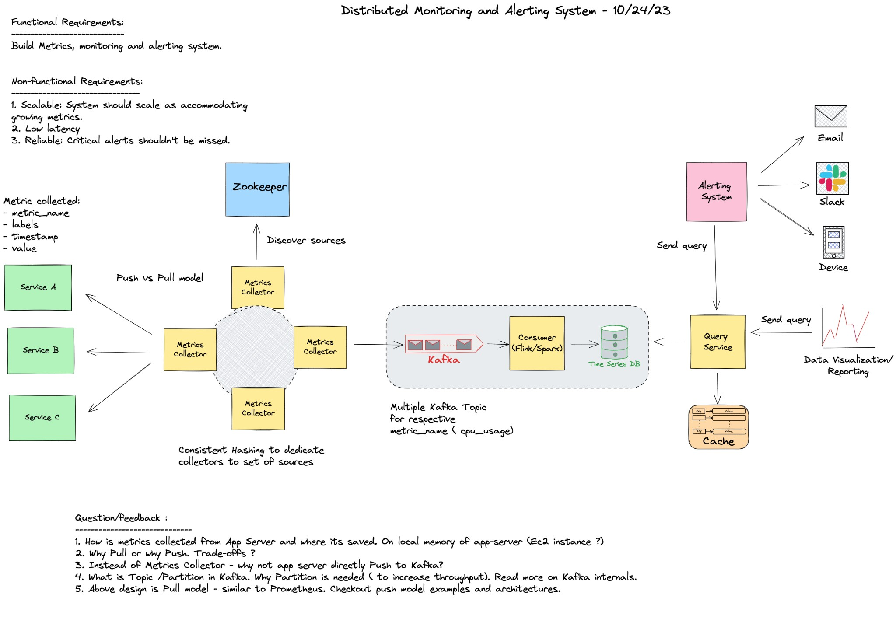
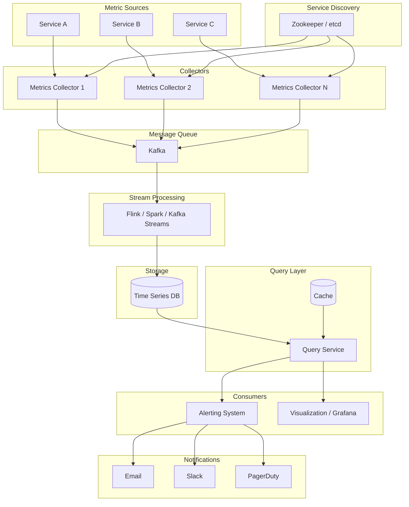
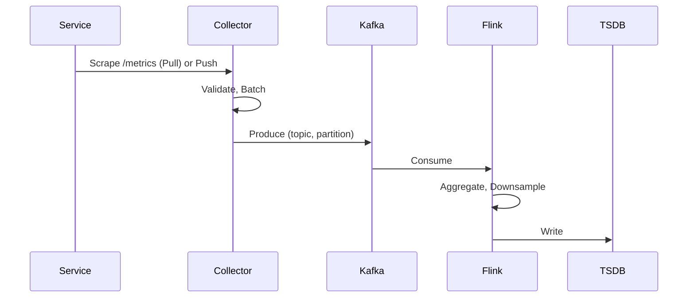
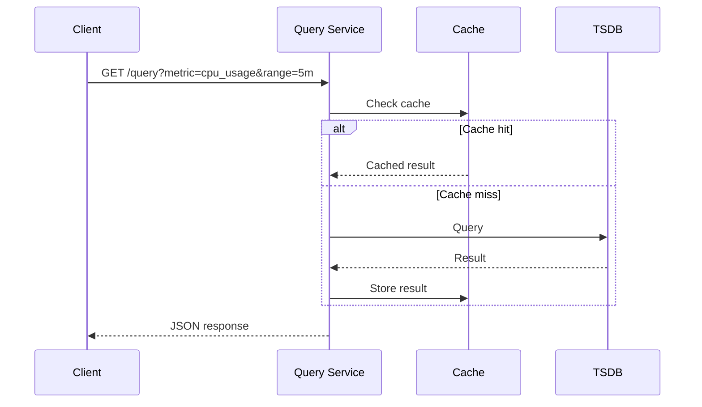
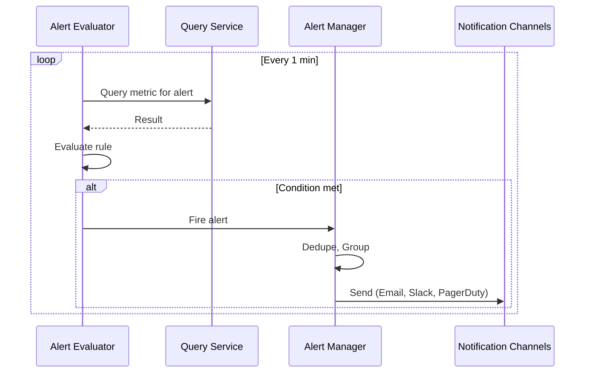

# Distributed Monitoring and Alerting System

> **System Design Interview Document** — FAANG-level technical interview preparation  
> *Design a scalable, low-latency, and reliable metrics collection, storage, and alerting platform.*

---

## Table of Contents

1. [Problem Statement](#1-problem-statement)
2. [Requirements](#2-requirements)
3. [Capacity Estimation](#3-capacity-estimation)
4. [Metric Data Model](#4-metric-data-model)
5. [High-Level Architecture](#5-high-level-architecture)
6. [Detailed Component Design](#6-detailed-component-design)
7. [Data Flow](#7-data-flow)
8. [Storage Design](#8-storage-design)
9. [API Design](#9-api-design)
10. [Key Design Decisions](#10-key-design-decisions)
11. [Scaling & Non-Functional Requirements](#11-scaling--non-functional-requirements)
12. [Trade-offs & Alternatives](#12-trade-offs--alternatives)

---

## 1. Problem Statement

Design a **Distributed Monitoring and Alerting System** that:

- Collects metrics from thousands of services (microservices, VMs, containers)
- Stores metrics for historical analysis and real-time dashboards
- Evaluates alert rules and delivers notifications when thresholds are breached
- Scales horizontally to handle millions of data points per second
- Ensures critical alerts are never missed

**Reference Diagram:** See [Overall System Design](#51-overall-system-design) for the hand-drawn architecture diagram.

---

## 2. Requirements

### 2.1 Functional Requirements

| ID | Requirement | Priority |
|----|-------------|----------|
| FR1 | Collect metrics from application servers and infrastructure | P0 |
| FR2 | Store metrics with configurable retention (e.g., 15 days hot, 1 year cold) | P0 |
| FR3 | Support ad-hoc and range queries (e.g., `cpu_usage{host=server1}[5m]`) | P0 |
| FR4 | Evaluate alert rules against metric data and trigger notifications | P0 |
| FR5 | Deliver alerts via multiple channels (Email, Slack, PagerDuty, SMS) | P0 |
| FR6 | Support dashboards and visualization (Grafana-style) | P1 |
| FR7 | Support metric aggregation (sum, avg, rate, percentiles) | P1 |

### 2.2 Non-Functional Requirements

| ID | Requirement | Target |
|----|-------------|--------|
| NFR1 | **Scalability** | Handle 10M+ data points/sec, 100K+ unique time series |
| NFR2 | **Low Latency** | End-to-end metric visibility < 30s; alert evaluation < 1 min |
| NFR3 | **Reliability** | 99.99% alert delivery; no data loss for critical metrics |
| NFR4 | **Availability** | 99.9% uptime for query and alerting paths |
| NFR5 | **Cost Efficiency** | Downsample/archive old data; optimize storage per metric type |

---

## 3. Capacity Estimation

### 3.1 Assumptions

| Parameter | Value |
|-----------|-------|
| Number of services | 10,000 |
| Metrics per service | 100 |
| Scrape interval | 15 seconds |
| Unique time series | ~1M |
| Data points per second | ~6.7M (10K × 100 / 15) |
| Metric size (avg) | ~100 bytes |
| Write throughput | ~670 MB/s |
| Query QPS | ~10,000 |

### 3.2 Storage (10 years)

| Retention | Resolution | Storage (approx) |
|-----------|------------|------------------|
| 15 days | 15s | ~100 TB |
| 90 days | 1m | ~50 TB |
| 1 year | 5m | ~100 TB |
| 10 years | 1h | ~200 TB |

**Total:** ~450 TB (raw + compressed)

---

## 4. Metric Data Model

### 4.1 Core Structure

```json
{
  "metric_name": "cpu_usage",
  "labels": {
    "host": "server1",
    "service": "checkout-api",
    "env": "prod",
    "region": "us-east-1"
  },
  "timestamp": 1698765432000,
  "value": 72.5
}
```

### 4.2 Schema Definition

| Field | Type | Description |
|-------|------|-------------|
| `metric_name` | string | Identifier (e.g., `cpu_usage`, `memory_utilization`, `request_latency_p99`) |
| `labels` | map<string, string> | Dimensions for filtering (host, service, env, instance_id) |
| `timestamp` | int64 (ms) | Unix epoch when metric was recorded |
| `value` | float64 | Numeric measurement |

### 4.3 Metric Types

| Type | Example | Use Case |
|------|---------|----------|
| Counter | `http_requests_total` | Monotonically increasing |
| Gauge | `memory_usage_bytes` | Current value |
| Histogram | `request_duration_seconds` | Distribution (percentiles) |
| Summary | `request_duration_seconds` | Pre-aggregated quantiles |

---

## 5. High-Level Architecture

### 5.1 Overall System Design

The following diagram provides a high-level view of the distributed monitoring and alerting system — from metric sources through collection, ingestion, processing, storage, and finally to querying, alerting, and visualization.



*Figure: End-to-end architecture showing Services → Collectors (with Zookeeper discovery) → Kafka → Flink/Spark → Time Series DB → Query Service (with Cache) → Alerting & Visualization*

### 5.2 Component Flow (Mermaid)



### 5.3 ASCII Architecture

```
┌─────────────────────────────────────────────────────────────────────────────────────────────────┐
│                              METRIC SOURCES (Services A, B, C, ...)                              │
└───────────────────────────────────────────────┬─────────────────────────────────────────────────┘
                                                │ Pull / Push
                                                ▼
┌─────────────────────────────────────────────────────────────────────────────────────────────────┐
│  METRICS COLLECTORS (Consistent Hashing)          │  ZOOKEEPER / etcd (Service Discovery)       │
└───────────────────────────────────────────────┬─────────────────────────────────────────────────┘
                                                │
                                                ▼
┌─────────────────────────────────────────────────────────────────────────────────────────────────┐
│  KAFKA (Topics: cpu_usage, memory_usage, request_latency, ...)                                    │
└───────────────────────────────────────────────┬─────────────────────────────────────────────────┘
                                                │
                                                ▼
┌─────────────────────────────────────────────────────────────────────────────────────────────────┐
│  STREAM PROCESSING (Flink / Spark / Kafka Streams) — Aggregation, Downsampling, Enrichment        │
└───────────────────────────────────────────────┬─────────────────────────────────────────────────┘
                                                │
                                                ▼
┌─────────────────────────────────────────────────────────────────────────────────────────────────┐
│  TIME SERIES DB (InfluxDB / TimescaleDB / VictoriaMetrics)                                       │
└───────────────────────────────────────────────┬─────────────────────────────────────────────────┘
                                                │
                                                ▼
┌─────────────────────────────────────────────────────────────────────────────────────────────────┐
│  QUERY SERVICE                          │  CACHE (Redis)                                         │
└───────────────────────────────────────────────┬─────────────────────────────────────────────────┘
                                                │
                    ┌───────────────────────────┼───────────────────────────┐
                    ▼                           ▼                           ▼
            ┌───────────────┐           ┌───────────────┐           ┌───────────────┐
            │   ALERTING    │           │   GRAFANA /   │           │   API / CLI   │
            │   SYSTEM      │           │   DASHBOARDS  │           │   CLIENTS     │
            └───────┬───────┘           └───────────────┘           └───────────────┘
                    │
                    ▼
            ┌─────────────────────────────────────────────────────────────────────────────────────────────────┐
            │  EMAIL  │  SLACK  │  PAGERDUTY  │  SMS  │  WEBHOOK  │  MOBILE PUSH  │
            └─────────────────────────────────────────────────────────────────────────────────────────────────┘
```

---

## 6. Detailed Component Design

### 6.1 Metric Sources (Application Servers)

**How metrics are collected and where they are stored:**

| Approach | Location | Mechanism |
|----------|----------|-----------|
| **Client Library** | In-process memory | SDK exposes counters/gauges (e.g., Prometheus client) |
| **Sidecar Agent** | Local memory / ephemeral disk | Agent scrapes `/metrics` or receives push |
| **Exporter** | Node exporter, cAdvisor | Exposes system metrics via HTTP |

**Storage on App Server:** Metrics are typically held in **in-memory** structures (counters, histograms) until scraped. No persistent storage on the app server unless using a push buffer (e.g., for batch jobs).

### 6.2 Metrics Collectors

**Responsibilities:**

- Discover targets via Zookeeper/etcd/Consul
- Scrape metrics on a schedule (Pull) or receive metrics (Push)
- Validate and normalize format
- Batch and forward to Kafka

**Load Distribution:**

- **Consistent Hashing:** Map each `(source_id, metric_name)` to a dedicated collector
- Ensures same source is always scraped by the same collector (reduces thundering herd)
- On collector failure, rebalance via ring

**Scaling:** Add collectors; new sources get assigned via consistent hash.

### 6.3 Kafka — Topics & Partitions

**Topic:** A logical channel for a category of records (e.g., `metrics.cpu_usage`).

**Partition:** A topic is split into ordered, immutable logs. Each partition is stored on a broker.

**Why Partitions?**

| Benefit | Explanation |
|---------|-------------|
| **Throughput** | Multiple producers/consumers can write/read in parallel |
| **Ordering** | Order guaranteed per partition (key-based routing) |
| **Fault Tolerance** | Replicas across brokers |
| **Consumer Group** | Each partition consumed by one consumer in a group |

**Partitioning Strategy:**

- **By metric_name:** `hash(metric_name) % num_partitions` — co-locate same metric type
- **By labels:** `hash(host, service) % num_partitions` — locality for same host

**Topic Layout:**

```
metrics.cpu_usage      (partition 0..N)
metrics.memory_usage   (partition 0..N)
metrics.request_latency (partition 0..N)
metrics.custom.*      (partition 0..N)
```

### 6.4 Stream Processing (Flink / Spark / Kafka Streams)

**Responsibilities:**

- **Aggregation:** 15s → 1m → 5m rollups
- **Downsampling:** Reduce resolution for older data
- **Enrichment:** Add metadata (region, tags)
- **Filtering:** Drop low-value metrics
- **Anomaly Detection:** Optional ML-based scoring

**Processing Pipeline:**

```
Raw Metrics → Windowing (1m) → Aggregation (avg, sum, p99) → Write to TSDB
```

### 6.5 Time Series Database

**Why TSDB (not SQL)?**

- Optimized for append-only, time-ordered writes
- High compression (delta encoding, Gorilla)
- Efficient range scans and aggregations

**Options:** InfluxDB, TimescaleDB, VictoriaMetrics, M3DB, Prometheus

### 6.6 Query Service

- REST/gRPC API for range queries, instant queries
- Aggregation functions: `sum`, `avg`, `rate`, `percentile`
- **Cache:** Redis for hot queries (e.g., last 5m of dashboard)

### 6.7 Alerting System

- **Rule Engine:** Evaluate conditions (e.g., `cpu_usage > 80% for 5m`)
- **Alert Manager:** Deduplication, grouping, silencing
- **Notification Router:** Route to Email, Slack, PagerDuty, etc.

---

## 7. Data Flow

### 7.1 Write Path



### 7.2 Read Path (Query)



### 7.3 Alert Evaluation Path



---

## 8. Storage Design

### 8.1 Time Series DB Schema (Conceptual)

```
Table: metrics
┌─────────────────────────────────────────────────────────────────────────────────────────────────┐
│  metric_name (PK)  │  labels (JSON)  │  timestamp (PK)  │  value  │  aggregation_level  │
├─────────────────────────────────────────────────────────────────────────────────────────────────┤
│  cpu_usage        │  {host:s1,...}  │  1698765432000   │  72.5   │  raw                │
│  cpu_usage        │  {host:s1,...}  │  1698765432000   │  71.2   │  1m                 │
└─────────────────────────────────────────────────────────────────────────────────────────────────┘
```

### 8.2 Retention Tiers

| Tier | Retention | Resolution | Storage |
|------|-----------|------------|---------|
| Hot | 15 days | 15s | SSD |
| Warm | 90 days | 1m | HDD |
| Cold | 1 year | 5m | Object storage (S3) |

---

## 9. API Design

### 9.1 Query API

```
GET /api/v1/query?query=cpu_usage{host="server1"}&time=1698765432
GET /api/v1/query_range?query=cpu_usage&start=1698760000&end=1698765400&step=60
```

### 9.2 Write API (Push Model)

```
POST /api/v1/push
Content-Type: application/json

[
  {"metric_name": "cpu_usage", "labels": {"host": "server1"}, "timestamp": 1698765432000, "value": 72.5}
]
```

### 9.3 Alert Rules API

```
POST /api/v1/alerts
{
  "name": "HighCPU",
  "expr": "cpu_usage > 80",
  "for": "5m",
  "labels": {"severity": "critical"},
  "annotations": {"summary": "CPU usage is high"}
}
```

---

## 10. Key Design Decisions

### 10.1 Push vs Pull Model

| Aspect | Pull (Prometheus-style) | Push (StatsD-style) |
|--------|------------------------|---------------------|
| **Who initiates** | Collector scrapes | Service pushes |
| **Service Discovery** | Required (Zookeeper) | Not needed |
| **Firewall** | Collector must reach services | Services push outbound |
| **Short-lived jobs** | Hard (scrape before exit) | Easy (push on exit) |
| **Control** | Collector controls rate | Service controls rate |
| **Coupling** | Low (service just exposes endpoint) | Higher (service knows push target) |

**Recommendation:** Use **Pull** for long-lived services; support **Push** for batch jobs, serverless, and edge cases.

### 10.2 Why Metrics Collector Instead of Direct Push to Kafka?

| Concern | Direct Push to Kafka | With Metrics Collector |
|---------|----------------------|-------------------------|
| **Coupling** | App needs Kafka client, SDK | App only exposes HTTP |
| **Format** | Each app defines format | Collector normalizes |
| **Retries** | App must implement | Collector handles |
| **Batching** | App must batch | Collector batches |
| **Fan-in** | 10K producers → Kafka | Fewer producers (collectors) |
| **Security** | Kafka credentials in app | Centralized in collectors |

**Collector** abstracts Kafka complexity, enforces schema, and provides a single point for batching and retries.

### 10.3 Kafka Topics & Partitions — Summary

- **Topic:** Logical stream (e.g., `metrics.cpu_usage`)
- **Partition:** Shard for parallelism; order guaranteed per partition
- **Partition count:** Start with `num_consumers × 2`; scale based on throughput

---

## 11. Scaling & Non-Functional Requirements

### 11.1 Scalability

| Component | Scaling Strategy |
|-----------|------------------|
| **Collectors** | Horizontal scaling; consistent hashing for load distribution |
| **Kafka** | Add partitions; add brokers |
| **Stream Processing** | Add consumer instances; increase parallelism |
| **Time Series DB** | Sharding by metric_name or time range; read replicas |
| **Query Service** | Stateless; load balancer; auto-scaling |
| **Cache** | Redis Cluster; read replicas |

### 11.2 Low Latency

| Technique | Target |
|-----------|--------|
| **Batching** | Collectors batch 100–1000 metrics before Kafka produce |
| **Async writes** | Kafka producer async; Flink checkpoint tuning |
| **Cache** | Redis for hot queries (e.g., last 5m) |
| **Pre-aggregation** | Pre-compute 1m rollups in Flink |
| **Connection pooling** | Reuse connections to TSDB, Kafka |

### 11.3 Reliability

| Technique | Implementation |
|-----------|----------------|
| **Kafka replication** | 3 replicas; `acks=all` |
| **Idempotent producers** | Prevent duplicate writes |
| **Retries** | Collector retries on Kafka failure; exponential backoff |
| **Dead letter queue** | Failed metrics → DLQ for replay |
| **Alert deduplication** | Alert Manager groups and deduplicates |
| **Alert retries** | Retry notification delivery (e.g., 3 retries) |

### 11.4 Availability

| Component | Strategy |
|-----------|----------|
| **Collectors** | Multiple instances; no single point of failure |
| **Kafka** | Multi-broker cluster; ISR |
| **Flink** | Checkpointing; savepoints |
| **TSDB** | Replication; read replicas |
| **Query Service** | Multi-AZ deployment |

### 11.5 Cost Efficiency

| Technique | Benefit |
|-----------|---------|
| **Downsampling** | 15s → 1m → 5m reduces storage |
| **Tiered retention** | Hot → Warm → Cold; cheaper storage for old data |
| **Compression** | Gorilla, ZSTD in TSDB |
| **Selective collection** | Drop low-value metrics |

---

## 12. Trade-offs & Alternatives

### 12.1 Alternative Architectures

| Approach | Pros | Cons |
|----------|------|------|
| **Prometheus + Thanos** | Mature, pull-based, open source | Operational overhead |
| **InfluxDB Telegraf** | Push-based, simple setup | Less ecosystem than Prometheus |
| **Datadog / New Relic** | Managed, full-featured | Cost, vendor lock-in |
| **OpenTelemetry + Collector** | Vendor-neutral, traces + metrics | Newer, less mature |

### 12.2 Storage Alternatives

| Option | Use Case |
|--------|----------|
| **VictoriaMetrics** | Prometheus-compatible, high compression |
| **M3DB** | Uber-scale, multi-tenant |
| **TimescaleDB** | SQL-friendly, PostgreSQL-based |
| **ClickHouse** | Analytics, ad-hoc queries |

### 12.3 Summary

This design prioritizes:

- **Scalability** via Kafka, partitioning, and horizontal scaling
- **Low latency** via batching, caching, and pre-aggregation
- **Reliability** via replication, retries, and deduplication

Trade-offs include operational complexity (Kafka, Flink) and the choice of Pull vs Push for different workloads.

---

## Appendix: Interview Checklist

- [ ] Clarify requirements (functional, non-functional)
- [ ] Estimate capacity (QPS, storage, retention)
- [ ] Define metric data model
- [ ] Draw high-level architecture
- [ ] Deep dive: Kafka topics/partitions
- [ ] Deep dive: Push vs Pull
- [ ] Discuss scaling and fault tolerance
- [ ] Discuss trade-offs and alternatives

---

*Document generated for FAANG-style system design interview preparation.*
